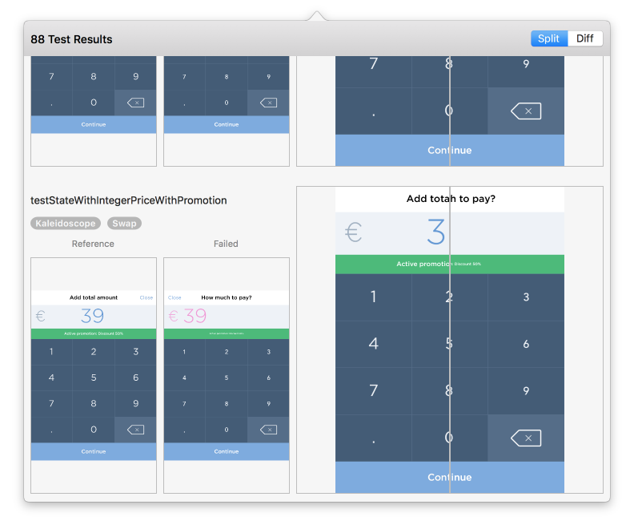

# FBSnapshotsViewer

A mac os application that shows the failing snapshot tests from [FBSnapshotTestCase](https://github.com/facebook/ios-snapshot-test-case) because it's a pain to parse the console logs by myself.

## Why FBSnapshotsViewer?

I've been using an amazing [plugin](https://github.com/orta/Snapshots) to check the failing test's snapshots, but unfortunately, with Xcode 8 the plugins are not officially supported anymore, so I've decided to build an app which will work regardless Apple's decisions about Xcode and plugins ecosystem.

There are some benefits using it:
* Real-time feedback about failed snapshot test.
* Real-time feedback about recorded snapshot test.
* Clear output with reference | diff | failed image

## How it works?

The idea behind the job is quite tricky, but the overall concept is straightforward:
1. The app listens for the changes in Xcode DerivedData folder;
2. When the app finds new .log file generated by Xcode it starts parsing it;
3. Through the parsing it extracts the generated information by iOS snapshot tests framework and shows in UI

## Installation

### FBSnapshotsViewer application

At the moment there is only one option to install the app:
Navigate to [releases](https://github.com/Antondomashnev/FBSnapshotsViewer/releases) and download the latest `FBSnapshotsViewer-xyz.app.zip` release.

## Usage

As simple as just run the app and run tests in your app 🎉

## Contribution

Contributions to FBSnapshotsViewer are welcomed and encouraged!
Please see the [Contributing guide](CONTRIBUTING.md) for more details.

## License

FBSnapshotsViewer is available under the MIT license. See [LICENSE](LICENSE) for more information.
